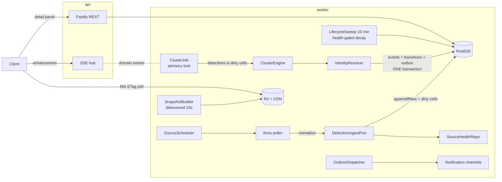
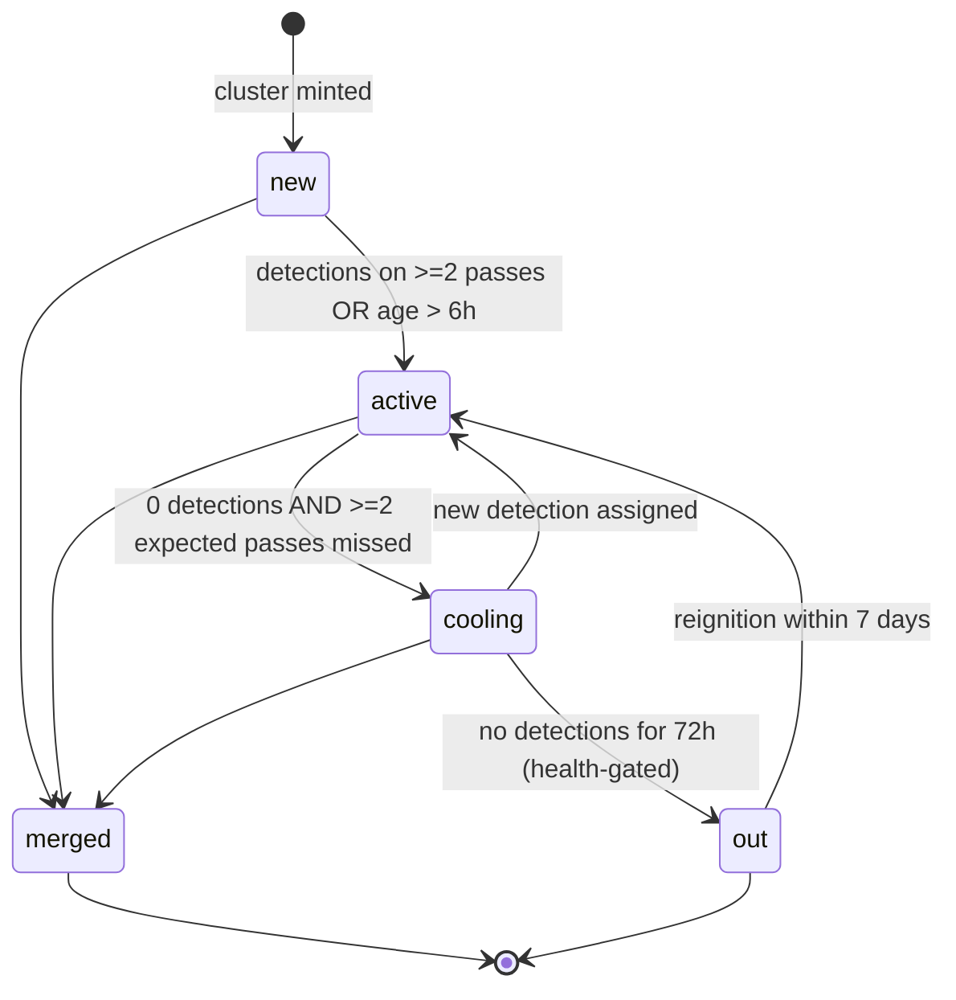

# Architect Review — Fire Watch server/system design

*Role: senior software architect. Scope: `docs/ANALYSIS.md` (2026-07-21) and ADR-001 (map stack).*
*Status of reviewed material: pre-code, discovery phase. Date of review: 2026-07-21.*

---

## 1. Summary verdict

**Conditional GO.** The overall shape — ports & adapters, append-only detections, FireEvent as
the core entity, PostGIS from day one, poll-not-stream, modular monolith — is the right skeleton
for this domain and this team size. The analysis is unusually honest about latency physics
("never imply live"), which is the correct product ethic *and* the correct architectural
constraint to design around.

However, three things are named in the analysis but not designed, and all three sit on the
critical path of the product promise:

1. **FireEvent identity under merge/split and reprocessing.** Alerts, URLs, and the future
   public API all hang off event IDs, yet the design says only "events merge/split". Without an
   identity-resolution design, the first cross-border mega-fire will break permalinks and
   double-alert users. This is the single hardest problem in the system and it must be specified
   before the first table is created.
2. **Alert delivery semantics.** "Alert engine → notification outbox" is one line in a diagram.
   Dedup state, transactional outbox, storm control, and merge-aware suppression are not
   optional hardening — they define whether the paid feature (geofence alerts) is trustworthy.
3. **The read path under spike load.** ADR-001 correctly makes *basemap tiles* spike-proof, but
   the *data API* (live events GeoJSON) is left as "Fastify REST + SSE" — a per-request DB read
   path that melts exactly when a Watch-Duty-style 600k-overnight spike arrives. The read path
   must be a CDN-served snapshot from day one, with SSE as progressive enhancement.

This review specifies concrete designs for all three (§6), audits the five key decisions (§6.3),
and flags twelve gaps the analysis missed (§4). Nothing here invalidates the MVP scope or the
4–6-week estimate materially — most of the required design is *decisions and schema discipline*,
not extra code — but the FireEvent identity layer and the outbox must be in the schema from
migration 001.

---

## 2. Strengths — validated

These are sound and should be locked in as-is:

- **S1. "Compete on aggregation, not detection."** Architecturally this is the load-bearing
  thesis: it makes the system source-agnostic by definition, which is exactly what ports &
  adapters buys. The FireSat bet (§3.4 of the analysis) falls out for free if the
  `Detection` normalization boundary is respected.
- **S2. FireEvent as the core entity, raw detections append-only.** Correct separation of the
  immutable fact stream (detections) from the derived, mutable product entity (events). This is
  the event-sourcing-lite shape this domain wants; it makes reprocessing (re-clustering with
  tuned params) possible at all. Keep it — but see §6.2 for what "append-only + reprocessing"
  actually requires.
- **S3. PostGIS from day one.** Right call, correctly distinguished from kiko's SQLite choice.
  `ST_DWithin` for geofences, `ST_ClusterDBSCAN` for MVP clustering, GiST indexes — the
  workload is natively geospatial and the volume (10²–10³ detections/day for the Balkans) is
  trivial for Postgres. No SQLite detour to throw away later.
- **S4. Poll-not-stream at MVP.** FIRMS for a Balkan bbox is a small CSV; a 5-min poller is
  proportionate. The 5,000 req/10 min quota gives ~3 orders of magnitude headroom. Correct
  deferral of EUMETCast/FCI push complexity until demand is proven.
- **S5. Honest freshness as first-class data.** `last_observed_at` + staleness rendering is
  both the ethical stance and the differentiator. §6.4 below promotes it from "UI feature" to
  "API contract invariant".
- **S6. ADR-001 (map stack).** MapLibre + OpenFreeMap→PMTiles is a well-reasoned ADR: the
  requirements are prioritized, the rejections are argued, the migration path (style JSON swap)
  is cheap. The spike-cost requirement (#1) is exactly right — it just needs to be extended to
  the data API (§6.6).
- **S7. Validation plan before code.** The latency ground-truth script and the FCI decode spike
  are the right pre-code de-risking moves. One addition required: a *clustering* validation
  dataset (§5, R5).
- **S8. Explicit non-goals** (no fire prediction, no dispatch tooling, no own sensors) — these
  keep the domain core small and are the reason a monolith is defensible.

---

## 3. Risks & gaps — severity-ranked

Severity: **Critical** = will break the product promise or force a rewrite; **High** = will
cause user-visible failure in season 1; **Medium** = costly rework if deferred past MVP;
**Low** = note and schedule.

| # | Severity | Risk / gap | Where designed |
|---|---|---|---|
| R1 | **Critical** | FireEvent identity is unspecified under merge/split/reprocess. Alerts and URLs reference event IDs; a merge without an aliasing design breaks permalinks, double-alerts users, and corrupts history. | §6.2 |
| R2 | **Critical** | Alert pipeline has no reliability design: no transactional outbox, no per-(zone,event) dedup state, no storm control, no merge-aware suppression. The paid feature is exactly the part with no design. | §6.5 |
| R3 | **High** | Read path is per-request DB queries + SSE. A media-driven traffic spike (the Watch Duty scenario the ADR itself cites) hits the data API, not just tiles. No CDN snapshot design exists. | §6.6 |
| R4 | **High** | Lifecycle transitions are wall-clock-driven with no source-health gating. When FIRMS has an outage (it does, multiple times per season), every active fire "goes cooling→out" — mass false all-clear, the one message the analysis vows never to send. | §6.2.4, §6.4 |
| R5 | **High** | Clustering is specified as "DBSCAN ~2 km / 24 h" with no validation dataset and no answer to DBSCAN's known failure modes: chain-merging (a valley of stubble burns becomes one mega-event) and mixed-resolution sources (2 km FCI pixels vs 375 m VIIRS points share one `eps`). | §6.2.2 |
| R6 | **High** | Agricultural-burn false positives are listed as a "mitigation later" but in Bulgaria stubble/pasture burning is a *seasonal flood* (spring, post-harvest). The land-cover filter is load-bearing at MVP, not an enrichment nicety — without it the map cries wolf in its first month. | §6.4 |
| R7 | **Medium** | Deployment shape contradiction: "one small VM **or serverless**" vs SSE + resident pollers + job scheduler. Serverless is incompatible with the proposed design; the option must be struck or the design changed. Decide now — it affects the composition root. | §6.3.4 |
| R8 | **Medium** | No observability design: no end-to-end latency budget, no per-source freshness metrics, no pipeline canary. For a product whose entire value is "fresh and correct", this is a launch blocker, not polish. | §6.4 |
| R9 | **Medium** | `next_expected_pass` is assumed as a data field but computing it requires orbital pass prediction (TLE propagation) or a pass-time heuristic — neither is in the plan. Silent scope. | §6.4 |
| R10 | **Medium** | GDPR section says watch-zone locations are "encrypted", but zones must be queryable with `ST_DWithin` — column encryption of geometry contradicts the core query. The mitigation needs to be access-control + minimization, designed honestly. | §6.5.4 |
| R11 | **Medium** | FIRMS NRT detections are later superseded by standard-processing (`_SP`) reprocessing; positions/attributes can shift and some NRT detections are retracted. No decision on reconciliation. | §6.1.3 |
| R12 | **Low** | EFFIS WMS is consumed directly by the browser: third-party availability, CORS, and their capacity become our UX. Also: attribution obligations (NASA/Copernicus/EUMETSAT) have no designated place in the UI design. | §7 (Q6) |
| R13 | **Low** | Multi-country expansion (v2) will fight every hardcoded `BG bbox`. Cheap to make the AOI config-driven now, expensive to unpick later. | §6.7 |
| R14 | **Low** | "Manual" appears in the ingestion diagram but curation is not an ingestion source — it is an override/annotation channel on *events*. Unmodeled, and it is the "Watch Duty secret sauce" the analysis itself identifies. | §6.1.2 |

---

## 4. What the analysis missed entirely (architect's checklist)

Beyond the ranked risks, these are absent from the analysis and must exist before code:

1. **Time semantics.** Every detection has three timestamps: `observed_at` (satellite
   acquisition, UTC), `published_at` (when the source made it available), `ingested_at` (when we
   saw it). All freshness UX derives from `observed_at`; all latency instrumentation derives
   from the deltas. Store all three from day one — they cannot be reconstructed later.
2. **Latency budget** (§6.4) — the word "real-time" appears throughout with no number attached
   to our own pipeline. Define and instrument: source-available → user-visible ≤ 7 minutes.
3. **Testing strategy for the core algorithm.** Clustering + identity resolution is the only
   genuinely hard code in the system and the plan has zero validation for it. Build a **replay
   harness** over FIRMS archive (`_SP`) data for one major 2024/2025 Bulgarian fire before
   tuning parameters (extends validation plan step 1).
4. **Backfill & first-launch state.** An empty map on launch day destroys trust. Seed from
   FIRMS archive (last 10 days NRT + season-to-date SP) at deploy time; this doubles as the
   replay-harness data path.
5. **Public ID scheme.** Sequential integers in URLs leak volume and invite enumeration; IDs
   must be short, permanent, and year-scoped for human readability: `fw-2026-k3d7q`
   (`public_id`, distinct from the DB PK).
6. **Cloud-cover semantics.** "No detection" ≠ "no fire" under cloud. At minimum this is UX
   copy on stale events; eventually a cloud-mask layer gates lifecycle decay (§6.2.4 makes
   decay health-gated, which covers the outage case; cloud gating is a v1+ refinement).
7. **Schema migration & backup discipline.** The detections table is the system of record —
   the only non-reconstructible data (NRT data ages out of FIRMS). Nightly logical backups to
   R2 from week one; migrations via a real tool (e.g. `graphile-migrate`/`drizzle-kit`) from
   migration 001.
8. **Security of the write surface.** The public read API can be open, but ingestion admin,
   curation, and reprocess endpoints need authn from the first deploy (even a static bearer
   token), because they will exist before user accounts do.
9. **SSE operational limits.** Browser HTTP/1.1 caps at ~6 connections per origin — SSE
   requires HTTP/2 termination (Caddy gives this for free); the hub needs heartbeats (~25 s)
   to survive proxies, and `Last-Event-ID` resume to survive reconnects.
10. **Alert copy as versioned artifacts.** "Alert copy reviewed for panic-minimization" (§6.4
    of the analysis) implies notification templates are reviewed, versioned assets — model them
    as such (template ID + version recorded per sent notification), not inline strings.
11. **Rate limiting / abuse** on the public API — trivial at MVP (per-IP token bucket in
    Caddy/Fastify), impossible to retrofit into B2B SLAs later if the URL structure didn't
    anticipate keys.
12. **Reprocessing ↔ alerting interaction.** Re-clustering history must never re-send alerts
    or resurrect `out` events. This invariant (I4, §6.2.3) exists nowhere in the analysis.

---

## 5. Detailed recommendations

Each maps to a risk above; designs are in §6.

1. **Adopt the two-layer event model** — ephemeral `Cluster` (recomputable) + stable
   `FireEvent` (identity registry with alias chain). Schema in migration 001. (R1 → §6.2)
2. **Write ADR-002: FireEvent identity & lifecycle** capturing the survivor rule, alias
   semantics, split rule, revival window, and the five invariants I1–I5. This is more important
   than any code written in week 1.
3. **Build the alert engine on a transactional outbox** in the same commit as event
   transitions; per-(zone,event) alert state in DB; storm-mode digesting. Ship the ports and
   tables at MVP even though channels ship at v1. (R2 → §6.5)
4. **Invert the live-update transport**: CDN-served `active-events.geojson` snapshot (ETag,
   60 s client poll) is the *primary* path; SSE is progressive enhancement behind a
   `LivePublisher` port. (R3 → §6.6)
5. **Gate lifecycle decay on source health**: no `active→cooling→out` transitions while the
   fire-detection sources are stale. Add a `source_health` table and a `LifecycleSweep` job
   that reads it. (R4 → §6.2.4)
6. **Cluster on pixel footprints, not centroids**, with per-source `eps`, and never let a
   coarse-source (FCI) detection *bridge* two fine-source clusters. Validate against a replayed
   real fire before tuning. (R5 → §6.2.2)
7. **Promote the land-cover mask to MVP scope**: CORINE-based agricultural mask applied at
   enrichment; agri-classified events get a distinct visual tier and are excluded from
   default-sensitivity alerting. (R6 → §6.4)
8. **Strike "serverless" from the architecture.** One small VM (Hetzner-class), two processes
   from one codebase (`api`, `worker`), Caddy in front, managed Postgres (Neon/Supabase — both
   support PostGIS) or containerized Postgres with R2 backups. (R7 → §6.3.4)
9. **Define the latency budget and instrument every hop** from day one; add a pipeline canary
   (persistent industrial heat sources in FIRMS — e.g. refinery flares — appear on most passes
   and verify the pipeline end-to-end without a real fire). (R8 → §6.4)
10. **Descope `next_expected_pass` v0 to a static pass-time table** (VIIRS/MODIS overpass
    windows for BG are stable within ±30 min day to day); wrap it in a `PassPredictor` port so
    a TLE propagator can replace it later without touching the domain. (R9)
11. **Replace "encrypt zones" with an honest GDPR design**: minimization (store zone centroid +
    radius only, no labels like "home" server-side unless user-entered), strict row-level
    access, deletion cascade, encrypted backups. Document that geometry is *not*
    column-encrypted and why. (R10 → §6.5.4)
12. **Decide NRT supersession policy now**: MVP ignores SP corrections for live events but the
    weekly archive-sync job appends SP detections with `source='..._SP'` for history/replay;
    events older than 7 days are frozen and never re-derived from SP data. (R11)
13. **Make the AOI configuration-driven** (`aois` table or config: name, bbox/polygon, tz,
    locale) — pollers, clustering, and snapshots iterate AOIs. Costs ~an hour now. (R13)
14. **Model curation as `CurationPort`** (event-level overrides/annotations), not as an
    ingestion source; remove "manual" from the ingestion row of the architecture diagram.
    (R14 → §6.1.2)

---

## 6. Architect deep dive

### 6.1 Module & boundary decomposition (ports & adapters, named)

The analysis's cut — ingestion adapters → domain core → delivery adapters — is directionally
right. What's missing is *where the ports are and what they're called*, and one structural
correction: **clustering must not run inline in the ingest call**. Ingestion's job ends at
"append normalized detections + mark dirty cells"; a separate clustering step (same process,
different unit of work) derives events. This decoupling is what makes reprocessing, crash
safety, and the FCI retrofit cheap.

#### 6.1.1 Module map

```
src/
  domain/            # pure TypeScript, zero IO, owns all port interfaces
    detection.ts     #   Detection value object, natural key
    fire-event.ts    #   FireEvent aggregate + lifecycle state machine
    clustering/      #   ClusterParams, IdentityResolver (pure), invariants
    alerting/        #   AlertPolicy: (zone, event, alertState) -> Notification[]
    ports.ts         #   every interface in §6.1.2
  ingestion/         # driving adapters, one dir per source
    firms/           #   poller + CSV normalizer (MVP)
    effis/           #   WMS availability checker (MVP; overlay itself is client-side)
    fci/             #   Data Store netCDF adapter (v1)
    open-meteo/      #   weather enrichment fetcher (MVP)
    scheduler.ts     #   cron-style SourceScheduler + SourceRun bookkeeping
  infra/             # driven adapters
    db/              #   PostGIS repos, migrations, outbox table, advisory locks
    geo/             #   CORINE land-cover lookup, settlements index, PassPredictor
    snapshot/        #   GeoJSON snapshot builder -> R2/CDN
  delivery/
    http/            #   Fastify routes (REST/GeoJSON), auth, rate limit
    sse/             #   SSE hub (implements LivePublisher)
    notify/          #   channels: webpush, email, telegram, webhook (v1/v2)
  app/
    api.ts           # composition root: HTTP + SSE (read-mostly, horizontally scalable)
    worker.ts        # composition root: scheduler + ingest + cluster + sweep + outbox drain
```

**Single-writer rule:** only `worker` writes detections/events; `api` writes only user data
(accounts, zones — v1). This makes scaling the API tier trivially safe and removes a whole
class of concurrency bugs before they exist.

#### 6.1.2 The ports, named

```ts
// domain/ports.ts — the complete port inventory for MVP + v1

// ── Driving ports (adapters call the core) ─────────────────────────────────
export interface DetectionIngestPort {
  /** Idempotent: resubmitting a batch is a no-op (natural-key dedup). */
  ingest(batch: NewDetection[], run: SourceRunMeta): Promise<IngestSummary>;
}
export interface EventQueryPort {
  activeEvents(q: { aoi: AoiId; bbox?: BBox; status?: EventStatus[] }): Promise<FireEventFeature[]>;
  eventById(id: PublicEventId): Promise<Resolved | MovedTo | NotFound>;   // MovedTo carries canonical id
  eventTimeline(id: PublicEventId): Promise<EventTimeline>;               // detections + transitions + annotations
}
export interface CurationPort {                                           // v1 (design now, stub at MVP)
  annotate(id: PublicEventId, a: Annotation, actor: CuratorId): Promise<void>;
  overrideStatus(id: PublicEventId, s: EventStatus, reason: string, actor: CuratorId): Promise<void>;
}
export interface ReprocessPort {
  /** Re-cluster a window with new params. Never re-alerts; never revives `out` (I4). */
  reprocess(w: TimeRange, p: ClusterParams, mode: 'dry-run' | 'apply'): Promise<ReprocessReport>;
}

// ── Driven ports (the core calls adapters) ─────────────────────────────────
export interface DetectionRepo {
  appendIfNew(batch: NewDetection[]): Promise<{ inserted: number; duplicates: number }>;
  inWindow(w: { cells: CellId[]; time: TimeRange }): Promise<Detection[]>;
}
export interface ClusterEngine {
  /** MVP impl: PostGIS ST_ClusterDBSCAN over footprints; pure w.r.t. inputs. */
  cluster(detections: Detection[], params: ClusterParams): Promise<Cluster[]>;
}
export interface EventRepo {
  activeInCells(cells: CellId[]): Promise<FireEvent[]>;
  save(events: FireEvent[], transitions: Transition[], uow: UnitOfWork): Promise<void>;
  resolveAlias(id: PublicEventId): Promise<PublicEventId>;  // follows merged_into, path-compressed
}
export interface ZoneRepo {                                  // v1 tables, MVP port
  zonesNear(geom: Geometry, maxKm: number): Promise<WatchZone[]>;         // ST_DWithin
  alertState(zone: ZoneId, event: EventId): Promise<AlertState | null>;
  migrateAlertState(from: EventId, to: EventId, uow: UnitOfWork): Promise<void>;  // on merge
}
export interface Outbox {
  enqueue(batch: Notification[], uow: UnitOfWork): Promise<void>;  // SAME transaction as EventRepo.save
}
export interface NotificationChannel {
  readonly kind: 'webpush' | 'email' | 'telegram' | 'webhook';
  deliver(n: Notification): Promise<Delivered | RetryableFailure | TerminalFailure>;
}
export interface LivePublisher { publish(e: DomainEvent): void; }         // SSE hub at MVP
export interface SnapshotWriter { rebuild(aoi: AoiId): Promise<void>; }   // GeoJSON -> R2/CDN
export interface SourceHealthRepo {
  record(run: SourceRunResult): Promise<void>;
  status(): Promise<SourceStatus[]>;    // consumed by LifecycleSweep and the /health API
}
export interface GeoContextPort {
  landCoverAt(geom: Geometry): Promise<LandCoverClass>;      // CORINE — MVP, not "later"
  nearestSettlement(p: Point): Promise<SettlementRef>;
}
export interface WeatherPort { windAt(p: Point): Promise<WindNowAndNext12h>; }
export interface PassPredictor { nextExpectedPass(p: Point, after: IsoUtc): Promise<PassEstimate>; }
export interface Clock { now(): IsoUtc; }
```

Domain events on the internal bus (in-process `EventEmitter` at MVP, behind `LivePublisher`):
`FireEventStarted`, `FireEventUpdated`, `FireEventsMerged`, `FireEventSplit`,
`FireEventStatusChanged`, `SourceWentStale`, `SourceRecovered`.

#### 6.1.3 The pipeline, end to end



Per-tick sequence (MVP, FIRMS):

1. `SourceScheduler` fires `firms/poller` (every 5 min, per AOI, per FIRMS source).
2. Poller fetches CSV, normalizes to `NewDetection[]` (three timestamps, per-source footprint
   polygon, normalized confidence), calls `DetectionIngestPort.ingest`.
3. Ingest: `appendIfNew` (natural key = `sha1(source, satellite, round5(lat), round5(lon),
   observed_at)`), record dirty cells (geohash-4), update `SourceHealth`.
   **Anomaly guard:** if inserted count > N× trailing baseline for the source, quarantine the
   batch (`status='quarantined'`), skip alerting, raise ops alert — this is the defense against
   a sensor artifact flooding the map (dawn/dusk sun-glint, FCI processing glitches).
4. `ClusterJob` (runs after any ingest that inserted rows; `pg_advisory_lock` prevents
   overlap): load detections in dirty cells within the active window (72 h) → `ClusterEngine`
   → `IdentityResolver` → in ONE transaction: upsert events, append transitions, enqueue alert
   candidates to outbox, clear dirty cells, advance watermark. Crash mid-run = nothing
   committed = rerun-safe (see §6.4).
5. Post-commit: publish domain events (SSE), trigger `SnapshotBuilder` (debounced),
   `OutboxDispatcher` drains channels with retry/backoff.
6. `LifecycleSweep` (cron, 10 min): decay transitions (`active→cooling→out`) — *only* while
   fire sources are healthy (§6.2.4).

NRT→SP supersession (R11): live events are built from NRT only; a weekly `firms/archive-sync`
job appends `_SP` detections for history and replay. Events with `ended_at` older than 7 days
are frozen — SP data never mutates them.

### 6.2 The FireEvent domain model

This is the heart of the review. The analysis treats "Detection[] → FireEvent (DBSCAN…; events
merge/split; lifecycle…)" as one line; it is actually three separable problems: **clustering**
(geometry), **identity** (naming clusters stably over time), and **lifecycle** (state over
time). Conflating them is how this goes wrong.

#### 6.2.1 Three-layer model

| Layer | Entity | Mutability | Identity |
|---|---|---|---|
| Facts | `Detection` | append-only, immutable | natural key (source/satellite/pos/time) |
| Derived | `Cluster` | recomputed every run, ephemeral | none — throwaway |
| Product | `FireEvent` | mutable registry | **stable `public_id`, permanent** |

A clustering run produces `Cluster[]` (sets of detection IDs + derived geometry). The
`IdentityResolver` then matches clusters to the existing `FireEvent` registry. **The public ID
lives only in the registry** — clustering can be re-run with different params forever without
minting new identities for the same physical fire.

Schema (migration 001, abridged):

```sql
detections(
  id bigint PK, natural_key text UNIQUE, source text, satellite text,
  geom geometry(Point,4326), footprint geometry(Polygon,4326),   -- pixel footprint!
  observed_at timestamptz, published_at timestamptz, ingested_at timestamptz,
  frp real, brightness real, confidence_raw text, confidence_norm real,
  day_night char(1), cell_id text, status text DEFAULT 'ok'      -- ok|quarantined
);
fire_events(
  id bigint PK, public_id text UNIQUE,           -- 'fw-2026-k3d7q'
  aoi_id text, status text,                      -- new|active|cooling|out|merged
  started_at timestamptz, first_observed_at timestamptz, last_observed_at timestamptz,
  ended_at timestamptz,
  centroid geometry(Point,4326), hull geometry(Polygon,4326), bbox geometry,
  detection_count int, max_frp real, source_mix jsonb,
  confidence_tier text,                          -- confirmed|unconfirmed|agri-likely
  land_cover_class text, nearest_settlement jsonb,
  merged_into bigint NULL REFERENCES fire_events(id),
  split_from bigint NULL REFERENCES fire_events(id),
  version int NOT NULL DEFAULT 1, updated_at timestamptz
);
event_detections(event_id, detection_id, PRIMARY KEY(event_id, detection_id)); -- reassignable
event_transitions(id PK, event_id, from_status, to_status, at, cause, meta jsonb);
```

#### 6.2.2 Clustering — fix the two known DBSCAN failure modes

The proposed "DBSCAN, ~2 km eps, 24 h window" will fail in two predictable ways:

1. **Chain-merging.** DBSCAN is transitive: a line of distinct agricultural burns spaced
   1.5 km apart along a valley merges into one absurd 40 km "fire". Real Bulgarian scenario
   every October.
2. **Mixed resolutions.** A 2 km FCI pixel centroid can sit between two distinct VIIRS-defined
   fires and bridge them.

Concrete fixes, in MVP scope:

- **Cluster footprints, not centroids.** Store each detection's pixel footprint (375 m box for
  VIIRS, ~1 km MODIS, ~2 km FCI) and cluster on footprint intersection/distance
  (`ST_ClusterDBSCAN` over footprint geometries with small eps, e.g. 750 m), so `eps` stops
  doing double duty as "pixel size compensation".
- **Coarse sources never bridge.** Two-pass clustering: pass 1 clusters fine sources
  (VIIRS/MODIS) only; pass 2 *assigns* coarse detections (FCI, later) to at most one existing
  cluster (nearest within its footprint), or forms a coarse-only cluster flagged
  `confidence_tier='unconfirmed'`. Coarse detections are attachment-only — they can never be
  the edge that connects two fine clusters.
- **Time is a window, not a dimension:** cluster the trailing 72 h of detections; temporal
  continuity is the identity layer's job, not DBSCAN's.
- **Cap cluster extent** (e.g. hull diameter > 30 km triggers a review flag, not an automatic
  event) — cheap sanity guard against chain-merges that slip through.
- **Validate on a replayed real fire** (FIRMS `_SP` archive for a major 2024/2025 BG fire)
  before tuning any of the above. Add this to the validation plan as step 5.

#### 6.2.3 Identity: merge, split, and the five invariants

**Identity resolution** (pure function, deterministic — this is what makes crash-rerun safe):

```
resolve(clusters, activeEvents):
  for each cluster C:
    candidates = active events E where |detections(C) ∩ detections(E)| > 0
                 (fallback for footprint-only overlap: hull intersection)
    0 candidates -> mint new FireEvent (new public_id)
    1 candidate  -> C updates E
    N candidates -> MERGE:
        survivor = min(candidates) by (started_at, -detection_count, id)   -- deterministic
        others   -> status='merged', merged_into=survivor
        survivor absorbs detections, hull, first_observed_at=min(...), source_mix
  events with no cluster this run -> untouched (lifecycle sweep handles decay)
  SPLIT: if one event's detections land in 2+ clusters:
        the cluster with the plurality of the event's prior detections keeps the id
        other clusters -> new events with split_from=old_id
```

```mermaid
sequenceDiagram
  participant CJ as ClusterJob
  participant IR as IdentityResolver
  participant ER as EventRepo
  participant ZR as ZoneRepo
  participant OB as Outbox
  CJ->>IR: cluster C overlaps events A(37 det) and B(12 det)
  IR->>IR: survivor = A (earliest started_at)
  IR->>ER: B.status='merged', B.merged_into=A; A absorbs B (one tx)
  IR->>ZR: migrateAlertState(B -> A)
  Note over ZR: zones already alerted for B are now<br/>"already alerted" for A — no duplicate "new fire"
  IR->>OB: enqueue EventsMerged update-notifications only
```

**Invariants (candidate ADR-002 content):**

- **I1 — Permanent resolution.** A `public_id`, once issued, resolves forever: `GET
  /v1/events/:id` returns the event, or `301` + `{merged_into}` to the canonical event. URLs
  and alert deep-links never 404.
- **I2 — Path compression.** Alias chains (B→A→C after successive merges) are compressed at
  write time; `resolveAlias` is always one hop.
- **I3 — Merge-aware alerting.** A merge must never produce a "new fire" notification for a
  zone already alerted on any constituent event (`migrateAlertState` runs in the merge
  transaction).
- **I4 — Reprocessing is conservative.** `reprocess` may change geometry and detection
  membership; it may never delete a `public_id`, never re-enqueue notifications, and never
  transition `out`→`active` unless invoked with an explicit `--allow-revive` flag.
- **I5 — Determinism.** Same detections + same params + same prior registry ⇒ identical
  identity assignment. (No randomness, no iteration-order dependence — required for crash
  rerun safety and for dry-run diffs to be meaningful.)

**Reignition:** a new cluster overlapping an `out` event within 7 days of `ended_at` revives it
(`out→active`, transition cause `reignition`); beyond 7 days it becomes a new event with a
`reignition_of` annotation. One rule, documented, no judgment calls at 2 AM.

#### 6.2.4 Lifecycle state machine (pass-aware, health-gated)



Two corrections to the analysis's `new→active→cooling→out` line:

1. **Decay is driven by *missed expected passes*, not wall-clock hours.** With 4–6 passes/day
   and ≤3 h latency, "no detection for 12 h" may mean one missed pass or cloud cover. The
   `LifecycleSweep` asks `PassPredictor` how many observation opportunities have elapsed since
   `last_observed_at`; thresholds are in passes (≥2 to `cooling`), with wall-clock as the outer
   bound (72 h to `out`).
2. **Decay is gated on source health (R4).** If `SourceHealthRepo` reports the fire-detection
   sources stale (no successful run with data for > 1 expected pass window), the sweep freezes:
   no `→cooling`, no `→out`. Otherwise a FIRMS outage reads as "all fires extinguished" — a
   mass false all-clear, precisely the message the product vows never to send. The UI shows
   "data delayed since HH:MM" instead (from `/v1/health`).

Curator overrides (v1, via `CurationPort`) can force `out` or pin `active`; overrides are
transitions with `cause='curator'` and are never overridden by the sweep.

### 6.3 Key decision audit

| Decision | Verdict | Conditions |
|---|---|---|
| PostGIS from day one | **Endorse** | Confirm PostGIS + a pooler on the chosen managed tier (Neon and Supabase both offer PostGIS; both need pooling with SSE-era connection counts). Keep all SQL inside `infra/db` repos so a self-hosted move is a connection-string change. Beware free-tier cold starts/suspend interacting with the 5-min poller — a paid ~€5–19 tier or self-hosted container is likely from month one; still within the cost envelope. |
| Poll, don't stream (MVP) | **Endorse** | Idempotent ingest via natural keys (FIRMS `day_range` windows overlap by design — dedup is mandatory, not optional); `SourceRun` bookkeeping; per-AOI per-source scheduling; anomaly quarantine guard (§6.1.3). |
| SSE for live map updates | **Endorse with inversion** | SSE beats WebSocket cleanly here: one-way flow, `EventSource` auto-reconnect + `Last-Event-ID`, plain HTTP. WebSocket buys nothing (no client→server stream). **But** neither is the primary transport: the CDN snapshot with ETag polling is (§6.6). SSE requires HTTP/2 at the proxy and 25 s heartbeats; keep it behind `LivePublisher` so multi-instance fan-out (or dropping SSE entirely) is an adapter change. |
| Monolith vs services | **Endorse (modular monolith)** | One codebase, two composition roots (`api`, `worker`), single-writer worker. This is the split point *if* scale ever demands services — and it probably never will: the write load is a few hundred rows per day. Do not introduce a queue/broker at MVP; Postgres (outbox + advisory locks + LISTEN/NOTIFY if needed) is the only coordination substrate. |
| Alert engine in the domain core | **Endorse with structure** | Split it: *matching* is a `ZoneRepo` query (ST_DWithin — a DB concern), *decision* is pure domain (`AlertPolicy(zone, event, alertState) → Notification[]`), *delivery* is outbox + channel adapters. The engine runs inside the clustering transaction (enqueue only); dispatch is async. A Telegram outage must never block ingestion. |
| "One small VM **or serverless**" | **Challenge — strike serverless** | Resident pollers, an in-process scheduler, SSE connections, and advisory-lock jobs all assume a long-running process. Serverless would force externalizing the scheduler, the SSE hub, and job locking — three complexity taxes for zero benefit at this scale. Decide: one VM. (R7) |
| Tippecanoe vector tiles for history | **Endorse, defer** | Correct for burned-area history at v1+; not MVP. Live events as plain GeoJSON is right — the volume argument (10²–10³/day) holds. |

### 6.4 Failure modes & degradation

| Failure | Blast radius if undesigned | Design |
|---|---|---|
| **FIRMS stale/outage** | All events decay to `out`; map shows false all-clear | `source_health` table; sweep freeze (§6.2.4); `/v1/health` exposed; UI banner "satellite data delayed since HH:MM"; ops alert at 2× expected pass interval. `SourceWentStale`/`SourceRecovered` domain events. |
| **Clustering job crashes mid-run** | Half-applied merges; orphaned aliases; double alerts on rerun | Whole run = one transaction (events + transitions + outbox + watermark). `pg_advisory_lock` per AOI prevents overlap. Determinism (I5) makes rerun produce identical output. Outbox `dedup_key = (zone_id, event_id, transition)` makes accidental double-enqueue a no-op. |
| **Notification storm** (big fire day: many events × many zones) | Push-provider throttling, user alert fatigue, channel bans (Telegram ~30 msg/s) | Outbox drained by priority (`new-fire` > `status-change` > `update`); per-user coalescing window (multiple events in one zone within 10 min ⇒ one digest message); global storm mode when outbox depth > threshold (switch `update`-class messages to digests); per-channel rate limiters in the dispatcher; retry with backoff, terminal-failure dead-letter table. |
| **Mass false-positive batch** (sensor artifact, agri-burn day) | Map cries wolf; alert storm; trust damage | Ingest anomaly quarantine (§6.1.3 step 3); land-cover mask demotes agri-likely events to a visual tier excluded from default alerting (R6); persistence rule already in analysis (≥2 detections before default-sensitivity alerts) — keep it. |
| **Traffic spike (media event)** | API tier melts; the product fails at its moment of maximum value | Read path = CDN snapshot (§6.6); SSE capped (connection ceiling, overflow falls back to polling — the client already polls); API detail endpoints cached (ETag + short s-maxage); DB touched only by detail/timeline queries. |
| **Merge during active alerting** | Users double-alerted; permalinks break | Invariants I1–I3 (§6.2.3). |
| **Snapshot builder fails** | Map data goes stale silently | Snapshot carries `generated_at` inside the payload; client renders staleness from it (the honest-freshness principle applied to *our own* pipeline, not just satellites); ops alert if snapshot age > 5 min. |
| **DB down** | Total outage | Acceptable at MVP (single region, managed PG with PITR); the CDN snapshot keeps the *map* readable during short DB outages — an underrated benefit of the snapshot-first read path. |

**Latency budget (instrument every hop from day one):**

| Hop | Budget | Metric |
|---|---|---|
| observation → available at source | uncontrollable (≤3 h NRT; ~min FCI) | `published_at − observed_at` (validates analysis §7.1) |
| available → ingested | ≤ 5 min | `ingested_at − published_at` |
| ingested → event updated | ≤ 60 s | cluster-run duration + lag |
| event updated → snapshot on CDN | ≤ 30 s | snapshot build lag |
| event updated → alert dispatched | ≤ 60 s | outbox dwell time |

**Pipeline canary:** persistent industrial heat sources (refinery/TPP flares) appear in FIRMS
on most passes; register one as a canary "event" (excluded from the public map and alerts) and
alert ops if it fails to refresh — end-to-end pipeline verification without waiting for a fire.

### 6.5 Alert engine (v1 feature, MVP architecture)

The analysis puts the alert engine in the diagram at MVP but the feature in v1. Correct
resolution: **ship the tables, ports, and outbox at MVP** (they cost hours), ship channels and
accounts at v1.

```sql
watch_zones(id PK, user_id, geom geometry(Point,4326), radius_m int,
            sensitivity text,           -- 'default' (>=2 detections) | 'high' (first detection)
            channels text[], created_at timestamptz);
alert_state(zone_id, event_id, last_alerted_status text, last_alerted_at timestamptz,
            PRIMARY KEY(zone_id, event_id));
outbox(id PK, kind text, payload jsonb, dedup_key text UNIQUE,
       priority smallint, status text,  -- pending|sent|failed|dead
       attempts int, next_attempt_at timestamptz, created_at timestamptz);
```

Flow: clustering transaction → for each changed event, `ZoneRepo.zonesNear(event.hull,
maxRadius)` → `AlertPolicy` (pure: compares event state to `alert_state`, applies sensitivity
and persistence rules, respects I3) → `Outbox.enqueue` in the same transaction → async
dispatcher drains by priority with per-channel rate limits.

**GDPR (R10, honest version):** zone geometry cannot be column-encrypted and remain
`ST_DWithin`-queryable. The real design: store the minimum (point + radius, user-chosen label
optional), row-level access control, TLS everywhere, encrypted backups, hard-delete cascade on
account deletion (zones, alert_state, outbox payloads, push tokens), and a retention rule for
notification payloads (strip location after delivery + N days). Write this down in the privacy
policy instead of the word "encrypt".

### 6.6 The read path (fixes R3)

Primary transport is a **pre-built snapshot**, not a per-request query:

```
worker: on any event change (debounced 15 s per AOI):
        build  /snapshots/{aoi}/active-events.geojson   (all new|active|cooling events,
               each feature: public_id, status, tier, centroid+hull, last_observed_at,
               max_frp, settlement; payload includes generated_at)
        upload to R2, strong ETag; CDN caches with s-maxage=30

client: polls the snapshot every 60 s with If-None-Match  → 304 most of the time
        opens SSE (if available) for sub-60s interactivity → on event, re-fetch snapshot
        detail panel & timeline → Fastify API (cacheable, ETag)
```

Properties: 600k concurrent map viewers cost CDN bandwidth only (flat, R2 has no egress fees);
the DB serves only detail views; SSE becomes optional garnish that can be capped or disabled
under load without degrading below the honest baseline; short DB outages don't blank the map.
This is the same reasoning ADR-001 applied to basemap tiles, applied to our own data — it
belongs in an ADR-003.

### 6.7 Evolution path MVP → v1 → v2: what gets thrown away?

| Component | MVP form | v1 (accounts, FCI, PWA) | v2 (API, B2B, multi-country) | Thrown away? |
|---|---|---|---|---|
| Domain core (event model, identity, lifecycle) | full | unchanged | unchanged | **No** — this is why it must be right now |
| `detections` schema | full (footprints, 3 timestamps, per-source confidence) | FCI rows slot in | more sources slot in | **No** — *if* footprint + source-tier exist from day one; retrofitting them under FCI is the expensive path |
| Ingestion adapters | firms, effis, open-meteo | + `fci/` (netCDF — hardest adapter, correctly deferred) | + per-country sources | No (additive) |
| Alert engine | tables + ports + outbox, no channels | + webpush/email/telegram channels | + `webhook` channel = the B2B product | **No** — webhooks are literally one more `NotificationChannel` if the outbox exists |
| API resource shapes | internal `/v1/…`, GeoJSON features, `public_id`, cursor pagination | same | **published as-is** with keys/quotas | **No** — design internal API as if public from day one |
| AOI handling | config-driven (`aois`), BG+buffer as the only row | same | + GR/MK/RS/RO rows, per-AOI snapshots | No (R13 handled) |
| Live transport | CDN snapshot + SSE (in-process hub) | same | SSE hub may need pub/sub fan-out if multi-instance | **Partially** — the in-process hub is the one consciously disposable piece; it hides behind `LivePublisher`, and the snapshot path means losing it costs nothing |
| Basemap tiles | OpenFreeMap public | Protomaps PMTiles on R2 | same | **Yes — planned** (ADR-001, style JSON swap; cheap by design) |
| DB hosting | managed free/low tier | likely paid tier | maybe self-hosted/HA | Config change only |
| Pass prediction | static pass-time table | TLE propagator behind `PassPredictor` | same | Yes — v0 heuristic, by design, ~50 lines |
| Curation | stubbed `CurationPort` | minimal curator UI + audit trail | org accounts reuse the auth | No |

Net: with the designs in this review, the only *planned* throwaways are the public tile
instance, the static pass table, and (possibly) the in-process SSE hub — all deliberately
cheap. Nothing in the domain core or schema needs a rewrite on the stated path. That is the
correct amount of disposable.

---

## 7. Open questions for the team

1. **ADR-002 (FireEvent identity & lifecycle):** does the team accept the survivor rule
   (earliest `started_at`), the 7-day reignition window, and invariants I1–I5 as stated in
   §6.2.3? These are product decisions wearing architecture clothing — sign them off explicitly.
2. **MVP alerting scope:** confirm MVP ships *zero* user-facing channels (tables + ports only)
   and the first real channel at v1. If any alerting sneaks into MVP (e.g. an ops Telegram
   feed), it must still go through the outbox — no shortcuts.
3. **EUMETSAT redistribution terms:** the analysis flags re-verifying FCI raw-data
   redistribution before the public API. This needs an owner and a date *before* v2 API design
   starts, because it may force an "derived events only, no raw FCI passthrough" API rule.
4. **Managed Postgres choice:** Neon vs Supabase vs a container on the VM — decide on the axes
   of PostGIS version, pooling, PITR, suspend behavior vs the 5-min poller, and EU region
   (GDPR). Recommendation: decide in week 1; it's a one-way door only for backups/PITR habits.
5. **Curation model at v1:** who curates (founder-only at first?), what does the audit trail
   require, and do curator annotations appear in the public API? Affects `CurationPort` scope.
6. **EFFIS WMS in the client:** accept the third-party dependency at MVP (with a UI failure
   state), or proxy+cache it server-side from day one? Recommendation: direct at MVP with a
   graceful "layer unavailable" state; revisit when traffic makes their capacity our problem.
   Also: designate where NASA/Copernicus/EUMETSAT attribution lives in the UI.
7. **Confidence tiers in UX:** the analysis has confidence scoring; §6.2.2 adds
   `confirmed | unconfirmed | agri-likely`. Product needs to decide how these render and which
   tiers can trigger alerts at which sensitivity — this couples directly to the false-positive
   trust budget.
8. **Alert SLO:** what do we promise (internally at v1, contractually at v2/B2B) for
   event-update → notification-dispatched? §6.4 budgets 60 s; B2B SLAs will want a number with
   a percentile on it, and the outbox metrics must exist first to know what's achievable.
9. **Storm-mode thresholds:** at what outbox depth / events-per-hour does digest mode engage,
   and is that per-user, per-AOI, or global? Needs a decision before the first bad fire day,
   not during it.
10. **Landing-page → product data continuity:** if the validation landing page collects
    watch-zone interest (village names), decide now whether that data model matches
    `watch_zones` — cheap alignment, avoids a migration of the very first user data.
